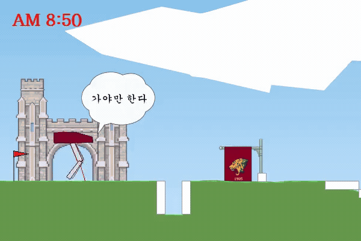
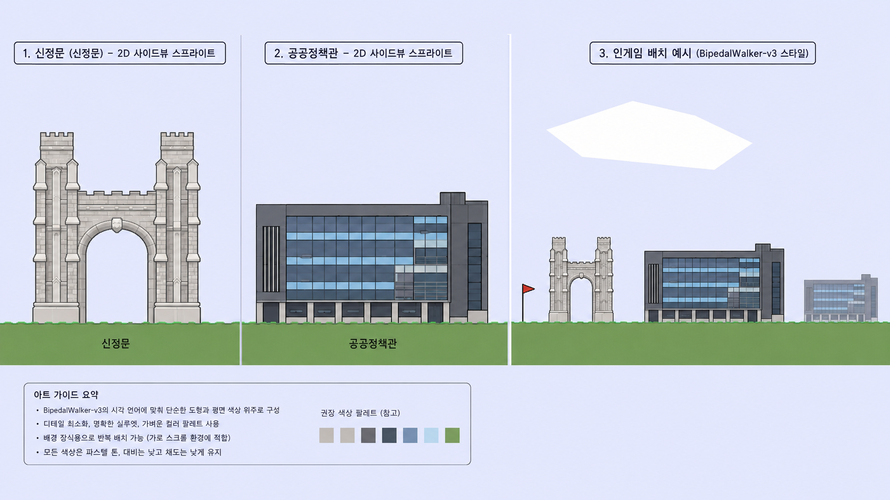

<h1 align="center">🦾 Training a Bipedal Agent with PPO on Hardcore Terrain</h1>

  
  
  
  

  
  
  
  
  

  Training a bipedal agent to clear randomized hardcore terrain — across 8 training phases with failure analysis, evaluation methodology, and targeted fine-tuning.

  

  Final model (Phase 8) · seed 103335 · score 289/300 · 1.75× speed

 

## 📌 Overview

A deep reinforcement learning project training a bipedal agent to navigate randomized hardcore terrain using **PPO (Proximal Policy Optimization)**.
Goes beyond running a script — includes failure analysis, evaluation methodology, and targeted fine-tuning across 8 training phases.

Framed as a story: a student racing across campus to make a 9 AM class, rendered on a custom map (Sinjeong Gate → Public Policy building).

 

## 📈 Training Phases

| # | Env | Steps | Result | Note |
|---|---|---|---|---|
| 1 | Standard | 1M | `ep_rew_mean` **+216** | Stable walking, course cleared |
| 2 | Hardcore | 3M | `ep_rew_mean` -54.8 | `explained_variance` 0.908 — understands the env, can't clear it |
| 3 | Hardcore | 5M | `ep_rew_mean` -35.9 | Straight continuation, first pit cleared |
| 4 | Hardcore | 7M | `ep_rew_mean` -46.3 → -52.5 | Regression; aggressive re-tuning made it worse |
| 5 | Hardcore | 10M | `eval` +46.23 @7.75M | Full rewrite: 8× parallel + VecNormalize + EvalCallback |
| 6 | Hardcore | +0.5M × 5 seeds | `eval` +56.77 | Multi-seed conservative fine-tune |
| 7 | Hardcore | 20M | `eval` **+120.72** @11.6M | LR floor fix; 50-ep mean +66.75, best episode +232.99 |
| **8** | **Stump-heavy** | **+3M** | **standard +64.32 / stumps +25.28** | **Targeted weakness patch (final)** |

> Honest 50-episode baseline: **-17.53** → Final: **+64.32**

 

## 💡 Key Engineering Insights

**Evaluation reliability**
10-episode peak (+46.23) collapsed to -17.53 on 50-episode re-validation. All phase comparisons standardized to 50-episode deterministic averages. Related: `ep_rew_mean` includes exploration noise and under-reports true performance by ~20 pts — `eval/mean_reward` is the real metric.

**CPU > GPU for this task**
`MlpPolicy` + `Box2D` is CPU-bound. `SubprocVecEnv` with `n_envs=8` achieved ~1,442 fps vs ~521 fps on CUDA — a 2.7× speedup by moving *off* the GPU.

**LR exhaustion as failure mode**
Reward collapse at 6–7M steps traced to LR decaying to near-zero. Raising LR and entropy to compensate made it worse (-46.3 → -52.5): aggressive updates overwrite an already-good gait. Fixed instead with an LR floor (`2e-5`); collapse disappeared and `explained_variance` reached 0.892.

**More steps ≠ better policy**
Checkpoint-level analysis of `evaluations.npz` identified 11.6M as the true peak (mean 120.7, 25th pct 48.4); the remaining 1.4M steps only degraded it. Fine-tuning resumed from that peak, not from the final checkpoint.

**VecNormalize must stay paired**
A mismatched `best_model.zip` / `vecnormalize.pkl` pair drops scores to -128. A custom `SaveVecNormalizeOnBest` callback saves both atomically on every new best.

 

## 🔍 Weakness Analysis & Fix

Two symptoms — the agent kept failing at **stumps**, and per-episode variance was enormous — turned out to be one problem: a single -100 fall wipes out an otherwise good run, so the weakness *is* the variance. Quantified it by biasing terrain generation:

| Env | Score (50-ep) |
|---|---|
| Standard Hardcore | +57.09 |
| Stump-heavy | +24.66 (**-32.43**) |

Phase 8 fine-tuned from the pre-degradation checkpoint (11.6M) with elevated stump frequency, low LR, and **evaluation on the standard env** to prevent over-specialization.

| (same seed, 50-ep) | Standard | Stump-heavy |
|---|---|---|
| Original (11.6M) | +66.90 | +10.27 |
| Stump fine-tuned | +64.32 | **+25.28** |
| Δ | -2.57 (within noise) | **+15.01 (+146%)** |

 

## 🏁 Results

| Metric | Value |
|---|---|
| Final eval score (50-ep) | **+64.32** |
| Best single-episode score | **292.3** / 300 |
| Total improvement from honest baseline | **+81.85 pts** |

Completion runs were harvested automatically: a two-pass seed scanner scores episodes without encoding, then re-renders only seeds that clear both the score threshold and full obstacle coverage (STUMP + STAIRS + PIT).

 

## 🎨 Custom Rendering

The final policy is visualized on a themed campus map — custom PyGame render layer in `bipedal_walker.py` with hand-made sprites, a running clock counting up to 9:00 AM, and speech bubbles at start and finish. Rendering only: training always used the unmodified `BipedalWalker-v3 (hardcore=True)` to avoid environment mismatch.

Asset design guide — campus landmarks redrawn as flat 2D side-view sprites to match the BipedalWalker-v3 visual language.

 

## 🛠 Tech Stack

Python, PyTorch, Stable-Baselines3, Gymnasium (Box2D), PyGame
PPO, Curriculum Learning, SubprocVecEnv, VecNormalize, EvalCallback

 

## 🚧 Limitations & Future Work

High episode-level variance is inherent to randomized hardcore terrain (std ~105).
Future work: selecting checkpoints by mean − std rather than mean, extending targeted fine-tuning to stairs/pits, ensemble checkpoints, SAC/TD3 comparison.

 

---

Undergraduate PBL project, Korea University Sejong · 3 presentation rounds · final grade **A+**
